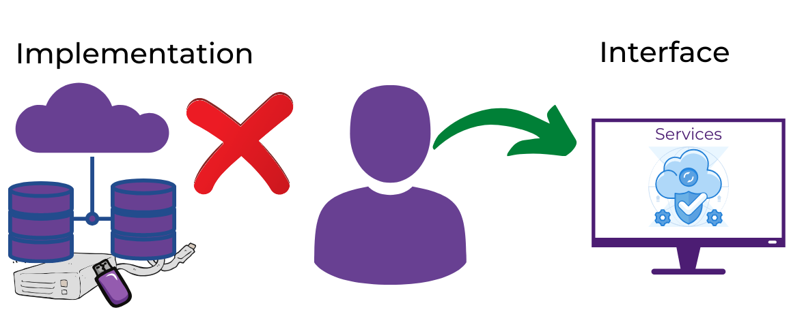

# Week 1 - In your Interface

## Assignment

1. Add the **contains** protocol and show whether or not 'Tim' and 'Sam' are part of our team.

   - See `in-your-interface.py`

2. Add the **iter** protocol and show how you can print each member of the classmates object.

   - See `in-your-interface.py`

3. Determine if the class classmates implements the `__len__` method.

   - See `in-your-interface.py`

4. Explain the difference between interfaces and implementation.

   - The interface is the services that are provided to an end-user. The interface is what defines the core means of communication between objects. Only public attributes and methods are considered part of the interface.
   - The implementation is the details that are hidden from the user. The implementation would contain the attributes and methods that are defined as private and is inaccessible to the end-user as it is considered part of the class's internal implementation. ;

5) Using both visual and written descriptions, think through the interface-implementation of a large scale storage system. In many systems today, we have the ability to store information from a single application to a variety of storage devices - local storage (hard drive, usb), the cloud and/or some new medium in the future. How would you design an interface structure such that all of the possible implementations could store data effectively.

In order to design an interface structure so that all of the possible implementations could store data effectively, I would:

- Ensure that a change in implementation would not require a change to the users' code
- Apply abstract thinking so it wouldn't matter if the user is using local or cloud storage
- Implementation would be hidden
- The interface would be kept to a bare minimum to start, and classes added as needed
